# Butler

Butler is a native macOS app that organises a folder with an agent. You choose a
folder, pick an engine and a model, and write the house rules in plain English.
The agent reads the folder through bounded tools and proposes a plan. Butler
shows the plan as a dense table on plain paper. You approve it, reject it, or ask for
changes in plain words. Only the app touches your files.

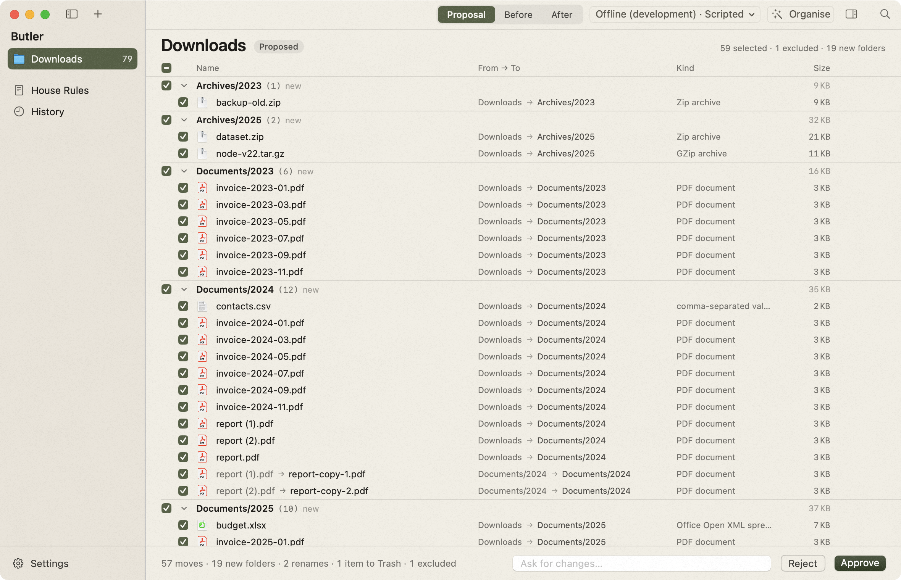

## The claim, and where the code keeps it

**"The agent cannot move or delete your files. It can only propose."**

| Claim | Where it is true |
| --- | --- |
| The engines have no shell, no file tools, and no web | `Sidecar/engines.ts`: Claude runs with `tools: []`, `skills: []`, `settingSources: []`, `strictMcpConfig: true`, and an `authorizeTool` that allows only `mcp__fold-harness__*`. Codex runs `app-server` with the shell tools disabled, a `read-only` sandbox, and approval policy `never`. |
| The tool surface has no write tool | `Sources/ButlerCore/Tools/ToolCatalog.swift`: `list_folder`, `inspect_file`, `propose_plan`. |
| `propose_plan` changes nothing | `Sources/ButlerCore/Tools/ButlerToolHost.swift` records the plan and answers "The plan is recorded and shown to the user." |
| Every path stays inside the folder | `Sources/ButlerCore/Files/PathGuard.swift` rejects absolute paths, `.`, `..`, hidden items, application packages, and symbolic links that leave the root. |
| A plan is validated as one transaction | `Sources/ButlerCore/Plan/PlanValidator.swift` simulates the whole plan: missing sources, collisions, overwrites, cycles, missing parents, depth, and weak trash reasons are all reported at once. |
| Only the app moves files | `Sources/ButlerCore/Plan/PlanApplier.swift` is the one file that calls `FileManager` write methods. |
| A removal goes to the Trash | The applier calls `trashItem(at:resultingItemURL:)`. It never calls `removeItem` on user content; the single `removeItem` call removes a folder that Butler created in the same run and only when it is empty. |
| Everything is undoable | Each applied run stores a journal (`AppliedAction`). History reverses it and restores trashed items from the URL the Trash returned. |

`swift test` covers the guard, the validator, the applier, undo, partial
failure, exclusion dependencies, the tool surface, and a full offline run
through the real sidecar.

## How the harness is used

Butler is a showcase for [`@serhiitroinin/fold-harness`](https://www.npmjs.com/package/@serhiitroinin/fold-harness).
The app never links a provider SDK. It launches the packaged sidecar and speaks
JSON-RPC 2.0 over stdio.

```
Butler.app (SwiftUI)
  └─ node node_modules/.bin/fold-harness-sidecar --host host.mjs --store <private dir>
        host.mjs = the engine kit (Claude Code + Codex, closed tool surface)
  └─ answers host/tool/call in Swift; the tools live in the app
```

The whole integration:

| File | Lines | What it does |
| --- | ---: | --- |
| `Sidecar/engines.ts` | 225 | The verified engine kit: two adapters, closed tool surface, exact environment, private Codex home, bounded tool-output redaction. |
| `Sidecar/discovery.ts` | 559 | Live models, effort levels and plan limits for both engines, from one short-lived probe with no tools and no turn. It mirrors the discovery API of the next harness release (the same module as in Easel) and goes away when that release is installed, together with the direct, exactly pinned `@anthropic-ai/claude-agent-sdk` dependency. |
| `Sidecar/host.ts` | 32 | The sidecar host module. `Sidecar/host.mjs` is its bundle, written by `Sidecar/scripts/build.sh` (and by `scripts/bundle.sh`), never edited and not committed. |
| `Sidecar/offline.ts` | 172 | A scripted development engine (`BUTLER_OFFLINE=1`), never shipped as a normal choice. |
| `Sidecar/prompt.ts` | 7 | The short system prompt. |
| `Sources/ButlerCore/Harness/SidecarClient.swift` | 204 | The JSON-RPC client: framing, discovery, run start, cancel, host tool calls. |
| `Sources/ButlerCore/Harness/SidecarProcess.swift` | 110 | The child process and its newline framing. |
| `Sources/ButlerCore/Harness/HarnessRequests.swift` | 116 | The few request payloads Butler sends. |
| `Sources/ButlerCore/Harness/ToolEnvironment.swift` | 56 | Finds `node`, `claude`, and `codex` through a login shell. |
| `Sources/ButlerCore/Harness/JSONValue.swift` | 89 | Accessors over the generated JSON value. |
| `Sources/ButlerCore/Session/HarnessService.swift` | 148 | One sidecar, engine discovery and its re-query, signal routing. |
| `Sources/ButlerCore/Session/RunController.swift` | 255 | One turn: live activity, usage, the recorded plan. |
| `Sources/ButlerCore/Session/EngineCatalog.swift` | 190 | Discovery types for the interface; no provider name appears in the UI code. |
| `Sources/ButlerCore/Session/ContextBuilder.swift` | 115 | Trusted rules, the untrusted folder snapshot, and the review context. |

About 1 550 lines in total without the scripted engine and the temporary
discovery module, of which 225 are the given kit. The engine and model picker,
the effort picker, the Codex "Speed" control, and the limits lines are all built
from `harness/profile`, `harness/models`, and `harness/limits`. Nothing in the
menu is a fixed list: the models and their effort levels are what the signed-in
account reports, and the plan limits sit under them as disabled items. Butler
asks again when the menu opens and after every run (the sidecar keeps a limit
snapshot for 20 seconds). When a catalog names no default effort the menu says
`Default` and the run sends none. The UI has no Codex-specific or
Claude-specific code.

`Sources/FoldHarnessV1/` is the generated Swift binding from the package,
vendored with its licence; refresh it with `scripts/refresh-bindings.sh`. Butler
decodes every sidecar answer with it. Requests use small local `Encodable`
structs because the generated parameter types require every optional field at
the call site.

## Build and run

```sh
cd Sidecar && bun install && cd ..     # installs the harness
bash Sidecar/scripts/build.sh          # writes Sidecar/host.mjs
swift build                            # or: swift test
bash scripts/bundle.sh                 # writes build/Butler.app
open build/Butler.app
```

Development, with no provider cost and no real folder:

```sh
bash scripts/make-demo-folder.sh                 # .demo/Downloads, about 60 files
BUTLER_OFFLINE=1 BUTLER_DATA_DIR=/tmp/butler-dev build/Butler.app/Contents/MacOS/Butler
node Sidecar/scripts/smoke.mjs                   # drives the sidecar over stdio
```

Environment variables: `BUTLER_OFFLINE=1` adds the scripted engine,
`BUTLER_DATA_DIR` moves the application data directory, `BUTLER_SIDECAR_DIR`
points at a sidecar directory.

Butler needs Node.js. It needs Claude Code or Codex, logged in, for a real run.
Settings lists what is missing with the command that installs it.

## Design

`docs/DESIGN.md` holds the direction, version 4, "full-bleed": paper is the
material of the whole window, not an object in it. Sidebar, toolbar, content
and bottom bar share one warm stock (charcoal in dark), separated by single
hairlines. A procedural paper grain lies over the entire window, titlebar
included (`Sources/ButlerApp/Design/Grain.swift`: an even tooth and a very
soft wide mottle, no flecks or fibres; generated at the backing scale, never a photo; dropped
under Reduce Transparency or Increase Contrast). One accent, a muted olive,
marks the selected sidebar row, the active segment, checkboxes, progress, and
Approve. Nothing imitates a physical thing: the status is a flat label next to
the folder name, inclusion is a checkbox, an excluded row dims and carries a
flat `Excluded` capsule, and a change request and the agent's reply are two
flat lines above the bottom bar.

The bones stay native: `NavigationSplitView`, real toolbar items, a pull-down
`Menu` for the engine, `.inspector`, a `Settings` scene, menu commands with
shortcuts, Quick Look, context menus, multi-select. Menus, popovers and
Settings are stock.

Density: rows are 22 pt with 12 pt text. At 1180 × 760 the proposal screenshot
shows 27 lines of the table: 22 file rows and 5 group headers (the demo
plan has 20 destination folders, so headers take about one line in five; the
reference's 26 file rows assume six groups).

On Approve the applier runs off the main thread and reports before each
operation; rows dim as their own operation finishes and a group reads `done`
after its last one. A failure stops there and shows its error on that row.

| | |
| --- | --- |
| Dark | 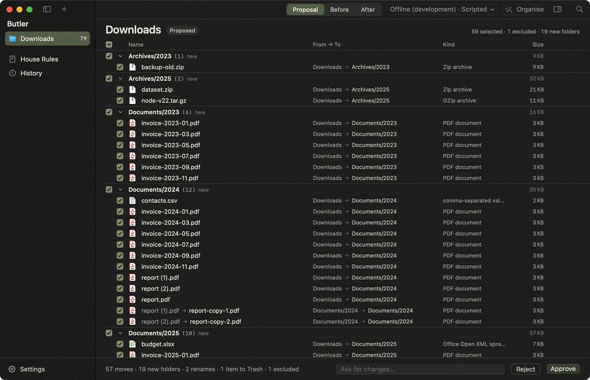 |
| Rows excluded | 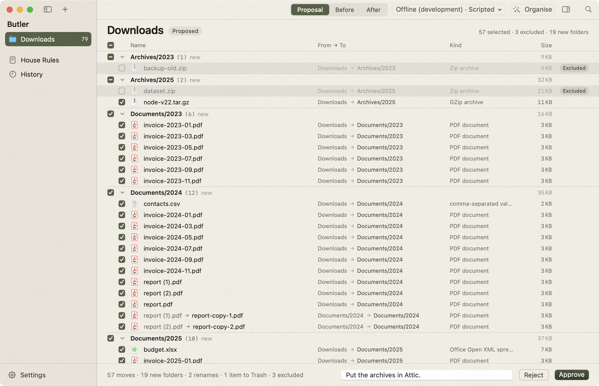 |
| Change request sent | 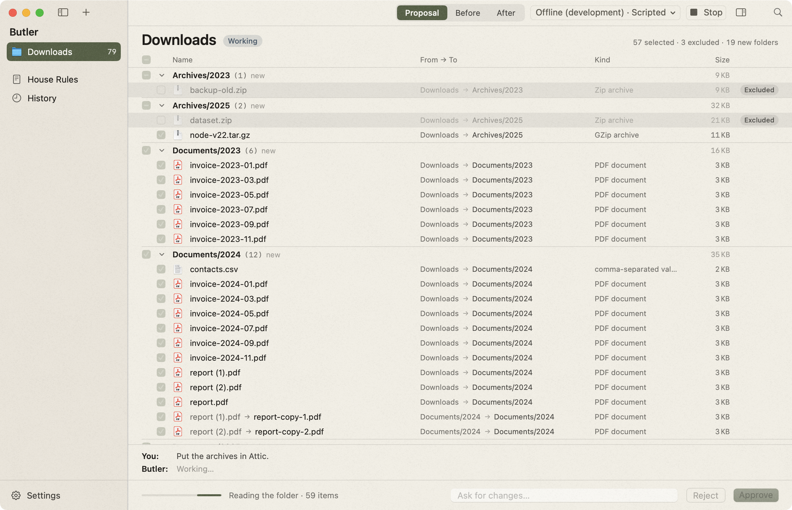 |
| Revision 2 with the agent's note | 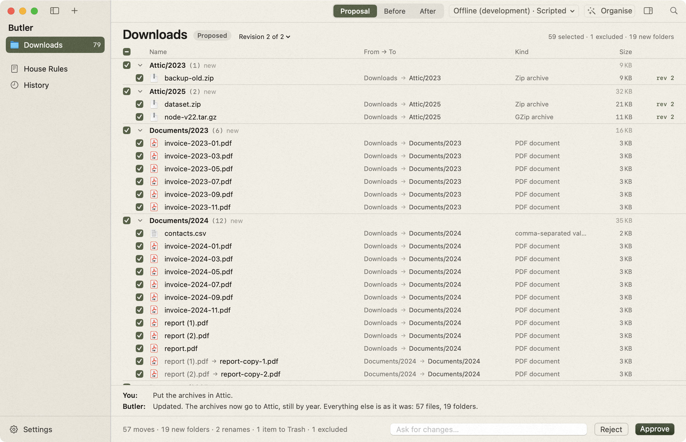 |
| Before: the folder as it is | 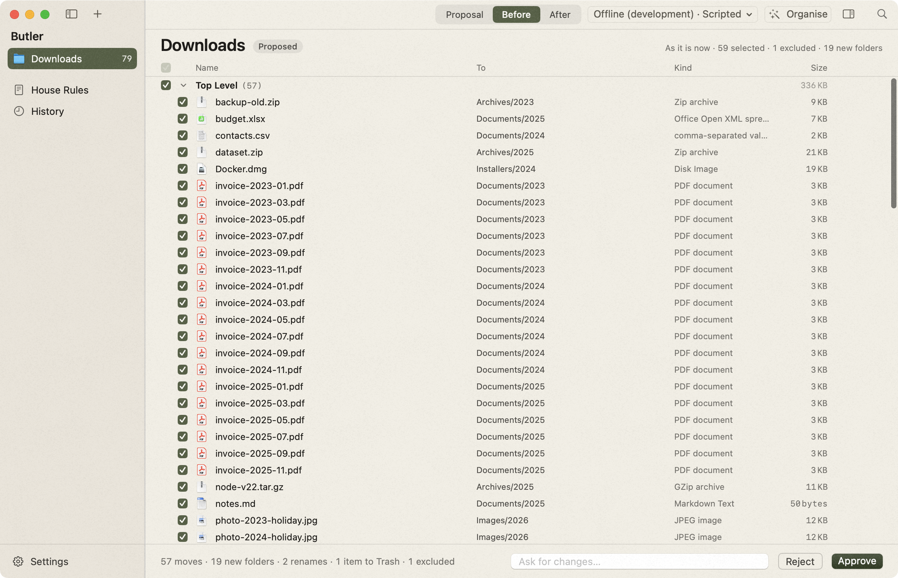 |
| After: the folder as it would be | 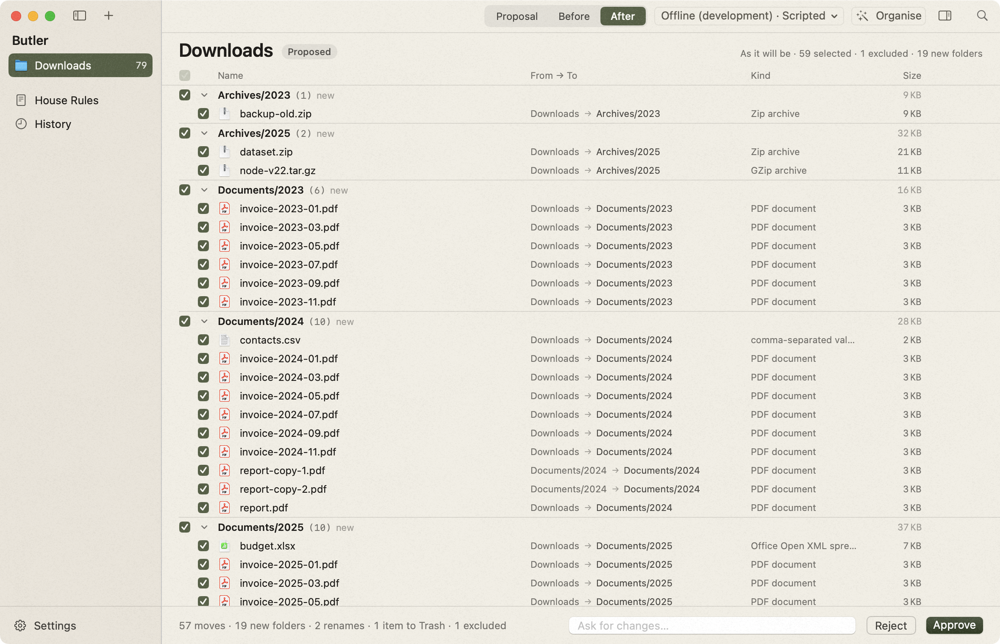 |
| Applying | 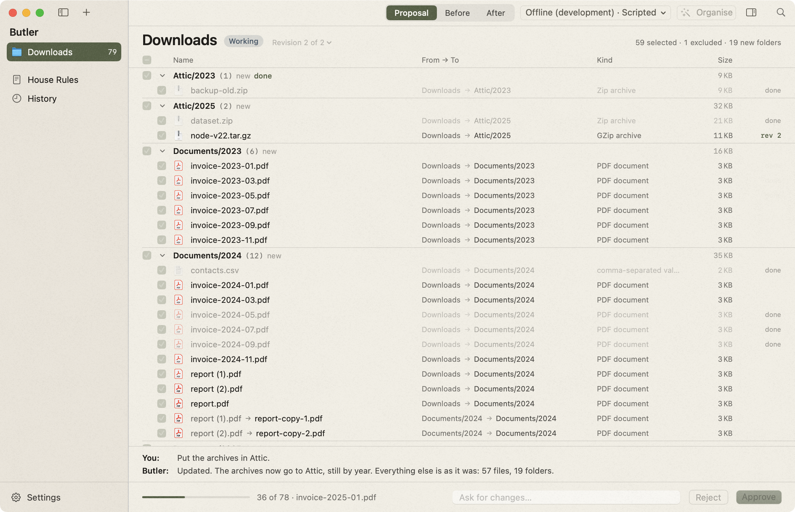 |
| Applied | 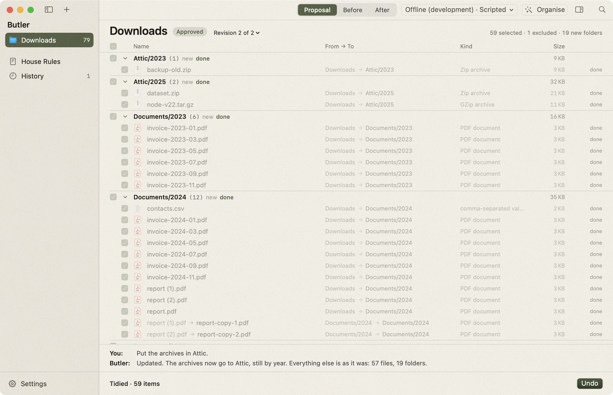 |
| An apply that failed: a locked file stops it, Undo puts the rest back | 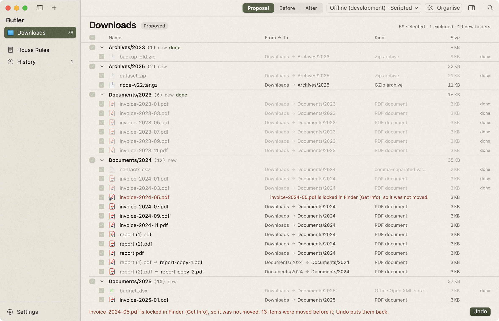 |
| History | 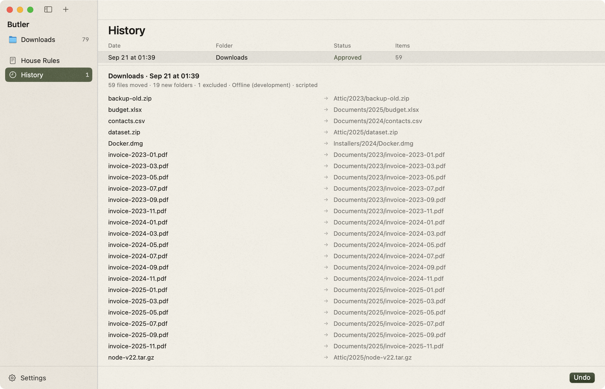 |
| House Rules | 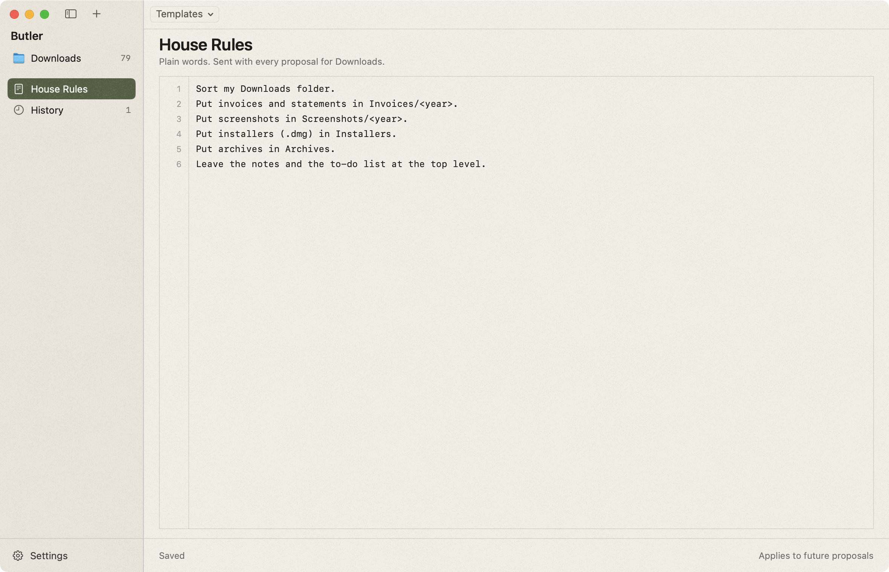 |
| Engine menu, scripted engine | 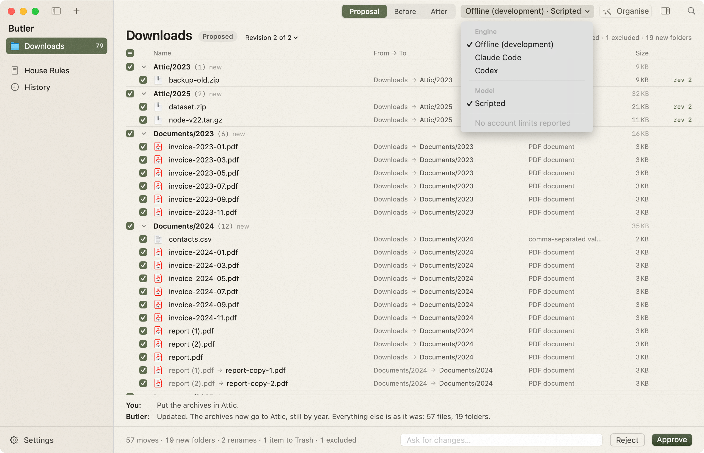 |
| Engine menu, live: the account's models, effort levels and limits | 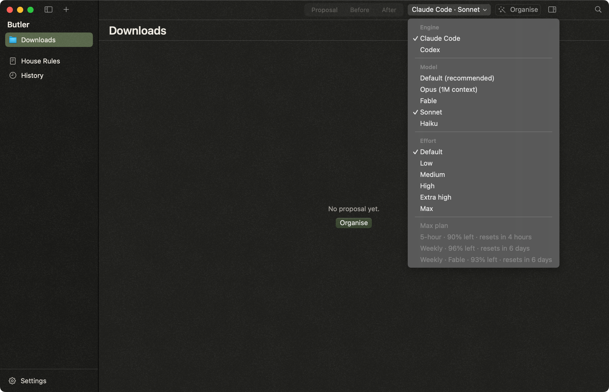 |
| Settings | 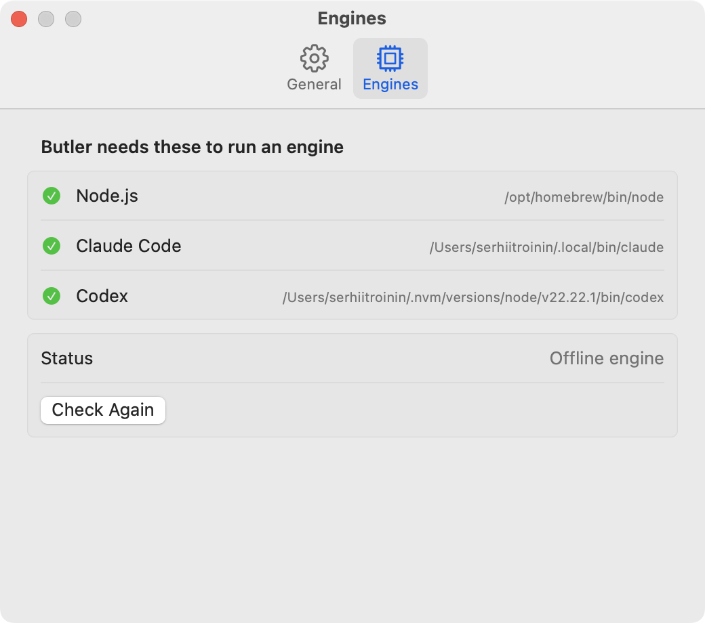 |
| Texture, 2x crop |   |

Every screen is captured in both appearances; `docs/screenshots/` holds the
pairs (`-light` / `-dark`), plus `live-claude.png` and `engine-menu-live-*.png`
from a live Claude run (`scripts/live-claude.sh`).

## Screenshots

`scripts/screenshots.sh [light|dark]` captures every state, one app instance at
a time, and fails loudly: every `osascript` call is bounded, every wait has a
deadline, and an app that dies stops the run. The app is driven through its
menu bar (Folder ▸ Organise, Exclude Selected, Ask for Changes, Approve Plan,
Undo Last Run; Go ▸ History, House Rules) and through development-only launch
arguments (`--appearance`, `--page`, `--stage`, `--select N`, `--ask "text"`,
`--fixed-size`, `--no-grain`), so no capture depends on a path into the view
tree and none types a keystroke. `BUTLER_OFFLINE_DELAY_MS` paces the scripted
engine and `BUTLER_APPLY_DELAY_MS` paces the applier, so the working and
applying states can be caught. `scripts/shot.sh <file> [app arguments]` takes
one screenshot.

The failed apply is a real one. The script locks one demo file
(`chflags uchg`, Finder's "Locked"), approves the plan, checks that the
applier stopped there with the earlier files moved, captures, runs Undo, and
checks that every file is back. `BUTLER_ONLY=failure` runs only that part.
`scripts/live-claude.sh [light|dark]` does one real Claude turn: the engine
menu as the account reports it, the proposal, Approve, Undo.

Windows are captured by window id, so a capture never shows another
application, and each one is checked to show the key window
(`scripts/window-active.swift`) and taken again if the focus was elsewhere.
The engine menu is the window and its menu captured separately and laid
together (`scripts/menu-composite.swift`). With `--fixed-size` the app holds
1180 × 760 itself. A tiling window manager keeps trying anyway, and a menu
opened during that fight drifts off the screen, so when the AeroSpace CLI is
present the scripts float the window once and otherwise leave the manager
alone.

## Known limitations

- Quick Look opens with Space for the selected row. The panel's rendered
  content is **unverified**: a Quick Look panel captures as its host window.
- The proposal table is a custom lazy stack, not `Table`: columns do not sort
  or resize.
- An older revision is read-only. There is no "restore this revision".
- Redo in History replays the moves and removals the run really made; it does
  not re-create a folder that the run created and left empty.
- The plan is kept in `~/Library/Application Support/Butler/state.json`. There is
  no migration for that file yet.
- The offline scripted engine understands one change request, "Put the
  <bucket> in <Folder>." Anything else gets the same plan again. Only a real
  engine really revises.
